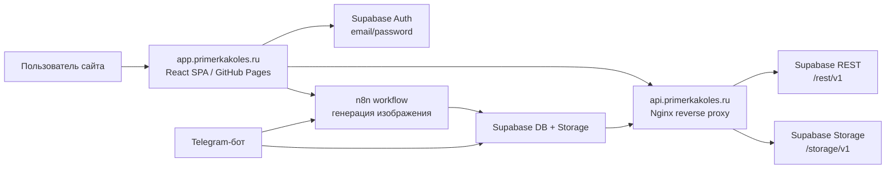
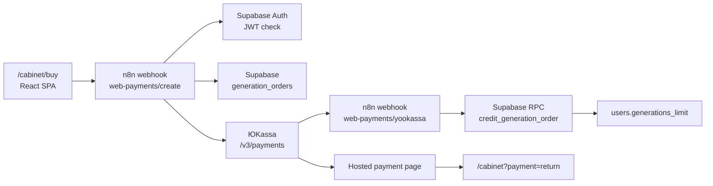

# Architecture

Техническая карта проекта `primerkakoles-app`.

Документ фиксирует текущую проверенную архитектуру web-приложения, внешних сервисов и общих данных. Если меняются Supabase, n8n, Telegram-бот, proxy, env или деплой, этот файл нужно обновлять вместе с кодом.

## Общая Схема

## Компоненты

### Web App

- Репозиторий: `primerkakoles-app`.
- Тип: React SPA на Vite.
- Домен: `app.primerkakoles.ru`.
- Деплой: GitHub Pages через GitHub Actions из ветки `main`.
- Точка входа: `index.html` -> `src/main.jsx` -> `src/App.jsx`.
- Основные маршруты:
  - `/` - главная.
  - `/try` - web-примерка дисков.
  - `/gallery` - публичная галерея.
  - `/my` - личные примерки пользователя.
  - `/login` - регистрация и вход по email/password.
  - `/cabinet` - личный кабинет.
  - `/support` - поддержка.

### Supabase

Supabase используется как общий backend-сервис для сайта и Telegram-бота.

- Auth: web-регистрация и вход по email/password.
- Database:
  - `users` - профиль, связь с Supabase Auth и Telegram, баланс генераций.
  - `generations` - записи генераций/примерок и ссылки на изображения.
- Storage: хранение изображений генераций.
- RLS и политики доступа критичны, потому что frontend использует публичный `VITE_SUPABASE_ANON_KEY`.

Важная модель пользователей:

- Web-пользователь связан через `auth_user_id`.
- Telegram-пользователь связан через `chat_id`.
- В таблице `users` есть поля, которые позволяют одной базе обслуживать оба канала: web app и Telegram-бот.
- Новые web-пользователи не получают бесплатную web-примерку: `generations_limit = 0`.

### Nginx Proxy

Production proxy: `https://api.primerkakoles.ru`.

Назначение:

- ускорить загрузку баланса, галерей и изображений Supabase Storage для пользователей в РФ;
- не включать Cloudflare proxy на `app.primerkakoles.ru`, так как это ломало доступность сайта для части пользователей.

Инфраструктура:

- VPS: `62.113.108.35`.
- OS: Ubuntu 24.04.
- Web server: Nginx.
- Конфиг на сервере: `/etc/nginx/sites-available/api.primerkakoles.ru`.

Маршруты:

- `/rest/*` -> `https://tzkvbtozhsrlmcpbrstp.supabase.co/rest/v1/*`
- `/storage/*` -> `https://tzkvbtozhsrlmcpbrstp.supabase.co/storage/v1/*`

Ключевые настройки:

- `proxy_ssl_server_name on`.
- `Host` прокидывается как `tzkvbtozhsrlmcpbrstp.supabase.co`.
- Заголовки `apikey` и `Authorization` передаются в Supabase.
- Таймауты соединения увеличены.

Что идет через proxy:

- профиль и баланс кабинета;
- публичная галерея;
- личная галерея;
- изображения из Supabase Storage.

Что пока не идет через proxy:

- Supabase Auth (`/auth/v1/*`) остается прямым через Supabase client.

### n8n

n8n отвечает за генерацию изображения.

Для web app текущий сценарий такой:

- пользователь на `/try` загружает фото автомобиля и фото диска;
- frontend конвертирует изображения в base64;
- frontend отправляет запрос на `VITE_WEBHOOK_URL`;
- в запросе передается Supabase access token в заголовке `Authorization: Bearer ...`;
- n8n выполняет workflow генерации;
- ожидаемый ответ для web app: изображение (`image/*`) как blob;
- результат отображается на сайте через `src/components/GenerationResult.jsx`.

Важно:

- URL n8n webhook является env-переменной и не должен храниться в git.
- Защита webhook от прямого несанкционированного использования остается важной задачей.
- Нужно отдельно проверять, где именно и кем обновляются `generations_used` и записи в `generations`.

### Telegram-Бот

Telegram-бот является отдельным каналом генерации и не относится к frontend-коду сайта напрямую.

Связь с web app:

- сайт содержит ссылку на Telegram-бота как способ сделать тестовую примерку;
- Telegram-бот также использует Supabase;
- результаты генераций из Telegram-бота попадают в ту же базу/Storage;
- поэтому в общих данных Supabase есть генерации из двух источников: web app и Telegram-бот.

Следствие для галерей:

- публичная галерея сайта читает таблицу `generations`;
- среди записей могут быть изображения, созданные через Telegram-бот;
- это ожидаемое поведение, если такие записи имеют `result_url` и проходят текущие фильтры галереи.

## Потоки Данных

### Регистрация И Вход На Сайте

1. Пользователь открывает `/login`.
2. Вводит email и пароль.
3. Frontend вызывает Supabase Auth напрямую.
4. Supabase trigger создает/обновляет запись в `public.users`.
5. Пользователь попадает в `/cabinet`.
6. Кабинет загружает профиль и баланс через `api.primerkakoles.ru/rest/users?...`.

### Web-Генерация

1. Пользователь открывает `/try`.
2. Frontend проверяет авторизацию и доступный баланс.
3. Пользователь загружает фото автомобиля и фото диска.
4. Frontend отправляет данные в n8n webhook.
5. n8n выполняет генерацию.
6. Результат возвращается на сайт как изображение.
7. Данные генерации и файлы могут сохраняться в Supabase внешним workflow.

### Telegram-Генерация

1. Пользователь взаимодействует с Telegram-ботом.
2. Бот запускает свой сценарий генерации.
3. Бот/n8n сохраняет пользователя, генерацию и изображения в Supabase.
4. Сайт может показать эти изображения в общей галерее, если запись подходит под фильтры.

### Галереи И Изображения

1. `/gallery` и `/my` запрашивают данные из `generations`.
2. В production основной путь чтения идет через `api.primerkakoles.ru/rest/generations?...`.
3. URL Supabase Storage преобразуются в `api.primerkakoles.ru/storage/...`.
4. Если proxy недоступен, в коде предусмотрен fallback на прямой Supabase client.

## Env И Secrets

Frontend env:

- `VITE_SUPABASE_URL`
- `VITE_SUPABASE_ANON_KEY`
- `VITE_WEBHOOK_URL`
- `VITE_PAYMENT_WEBHOOK_URL`
- `VITE_EDGE_URL`

Production:

- значения задаются в GitHub Secrets для GitHub Actions build;
- `.env` остается только локально;
- `.env` не должен попадать в git;
- `.env.example` содержит только placeholders.

Важно:

- `VITE_SUPABASE_ANON_KEY` публичен в браузерном bundle по природе frontend-приложения;
- безопасность должна держаться на RLS Supabase, проверке access token в n8n/webhook и серверных ограничениях;
- Supabase `service_role` нельзя использовать во frontend.

## Исторические Решения

### Cloudflare Worker

Был подготовлен Cloudflare Worker `primerkakoles-edge` для `/api/*` и `/media/*`.

Статус: архивный/экспериментальный вариант, не production.

Причина:

- при включении Cloudflare proxy на `app.primerkakoles.ru` сайт стал недоступен части пользователей в РФ;
- вместо этого выбран отдельный Nginx proxy на `api.primerkakoles.ru`.

Код Worker оставлен в `cloudflare/` как история и возможная заготовка, но не должен использоваться как текущая production-инструкция.

## Критичные Риски

- Сломать RLS и открыть приватные данные.
- Начать выдавать web-пользователям бесплатные генерации при регистрации.
- Смешать web app и Telegram-бот как один продуктовый сценарий: данные общие, но интерфейсы разные.
- Забыть, что галерея может показывать Telegram-генерации из общей таблицы `generations`.
- Нарушить Nginx proxy headers: без `apikey`, `Authorization` или правильного `Host` Supabase REST/Storage может перестать работать.
- Считать Cloudflare Worker актуальным production-решением.
- Положить реальные env/secrets в git.

## Что Нужно Уточнить Позже

- Как n8n различает web-генерации и Telegram-генерации в таблице `generations`.
- Есть ли в `generations` надежное поле-источник (`web`, `telegram`, `bot` и т.п.) или его нужно добавить.
- Где именно обновляется `generations_used`: в n8n, webhook, Telegram-боте или другом сервисе.
- Нужно ли проксировать Supabase Auth через `api.primerkakoles.ru/auth/v1/*`, если вход будет тормозить в РФ.
- Какие RLS-политики нужны перед подключением оплаты и покупкой генераций.

## Web-Оплата Через ЮKassa

- Web app не хранит секреты ЮKassa и не начисляет баланс.
- `generation_orders` хранит историю web-платежей и защищает от повторного начисления.
- `credit_generation_order` вызывается серверной логикой после `payment.succeeded`; повторный webhook не добавляет генерации второй раз.
- `generations_used` остается счетчиком фактических генераций и не меняется при покупке.
- Рабочий Telegram workflow не меняется; для web добавлен отдельный шаблон `n8n/primerka-web-payments.importable.json`.
- ЮKassa требует email или телефон покупателя для чека. Текущий web-сценарий передает email из Supabase Auth как `customer_email`; n8n валидирует его до создания платежа.
